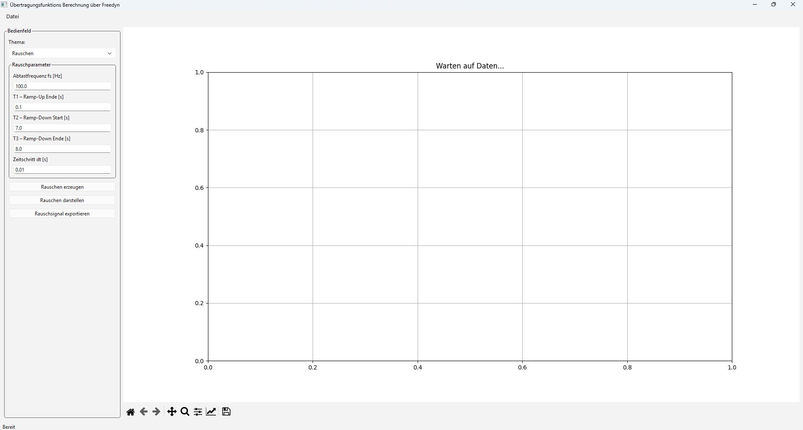

# Abschlussprojekt: Übertragungsfunktionsrechner über Freedyn

## Kurzbeschreibung
Das Programm dient zur Schrittweisen Berechnung einer Übertragungsfunktion von einem Freedyn Model.
Das Freedyn Model darf nur einen Eingang und einen Ausgang haben.
Es gibt viele Anwendungen, wofür Übertragungsfunktion benötigt werden (z.B. Prüfstands Technik, Inverse Kinematik, Regelungstechnik, ....).
Zusätzlich interessiert mich die Software Freedyn und die Möglichkeit über eine andere Software (z.B. Scilab, Python, ...) mit Freedyn zu arbeiten.

## Funktionen

### Wichtigste Funktionen
- generate_noise
- plot_noise
- safe_Rauschsignal
- run_simulation
- plot_simulation
- calc_transfer_function
- plot_transfer_function
- safe_transfer_function

### Simulation durchführen (run_simulation)
Anfangs war geplant als Schnittstelle zwischen Python und Freedyn das Modul fdApi zu verwenden.
Da aber beim Versuch das Programm auf einem anderen Rechner zu betreiben eine Fehlermeldung im Modul fdApi ("global fdci_dll") ausgegeben wurde, gab es eine Plan Änderung.
Das Ausführen der Simulation und das Einlesen der Messung wird ohne dem Modul fdApi realisiert.
Dafür wird folgender Befehl verwendet:
```bash
command = [str(free_dyn_exe), str(fds_base) + ".fds"]
subprocess.run(command, check=False)
```
Nachteil bei dieser Version ist, das beim Verwenden vom Programm auf einem anderen Rechner der Pfad "free_dyn_exe" angepasst werden muss.

### Rosa Rauschen und Lesen der Messung von Freedyn
Der Originalcode in Scilab wurde von Professor Witteween uns bei den Fallstudien im 2. Semester zur Verfügung gestellt.

## Verwendete Technologien
Das Programm wurde in Visual-Studio-Code mit der Programmiersprache Python programmiert.

### Verwendete Python-Bibliotheken
- sys
- os
- pathlib
- subprocess
- numpy
- matplotlib
- PyQt6
    
### Verwendete Techniken
Die Interaktion und Bildausgabe erfolgt über QMainWindow.
Das Programm ist in mehre Funktionen strukturiert.
Zwei Funktionen sind in einem eigenen File (Module) und werden im main importiert.

## Installation und Einrichtung (Vorbereitung)

```bash
cd final-assignment/Oliver_Strassl/code
pip install -r requirements.txt  # wen noch kein Virtual Environment, mit den richtigen Pakten, exisitert.
```

Um den Programmteil Simulation durchführen zu können, müssen für den jeweiligen Rechner zwei Anpassungen vorgenommen werden.
1. Im Code "main" muss in der Funktion "run_simulation" Zeile 406 die aktuelle Adresse von FreeDyn.exe ersetzt werden.
2. Freedyn muss gestartet werden und das Simulationsfile geöffnet werden. Danach muss unter "Data Object/spline" die Anregungsdatei unter dem Ordner "data" ausgewählt werden.

## Verwendung
Nach der Vorbereitung kann das Programm gestartet werden, indem main ausgeführt wird.

```bash
python main.py
```

Unter Datei muss das richtige Simulationsfile ausgewählt werden.
Danach muss das Programm Schritt für Schritt (von oben nach unten) durchgegangen werden.

### Thema = Rauschen
- Unter dem Thema Rauschen können die Parameter für das Rauschsignal an die Anwendung angepasst werden.
- Danach kann man die Taste "Rauschenerzeugen" klicken. Das Programm erstellt dann das Rauschen. Das Rauschsignal ist nur im Programm gespeichert.
- Als nächstes kann das Rauschen in der rechten Grafik dargestellt werden.
- Um das Rauschsignal dann in der Simulation verwenden zu können, muss das Rauschsignal exportiert werden. Als Name muss der Name verwendet werden, mit dem die Anregungsdatei in Freedyn eingelesen wird.

### Thema = Simulation
- Die Simulation kann ausgeführt werden.
- Wenn die Simulation fertig ist, erscheint dann in der unteren linken Ecke die Meldung "Simulation erfolgreich"
- Das einlesen das Ergebnis (measure_file) findet automatisch statt.
- Danach kann das Simulationsergebnis dargestellt werden.
### Thema = Übertragungsfunktion
- Die Übertragungsfunktion kann nun berechnet werden.
- Dann kann die Übertragungsfunktion ebenfalls dargestellt werden.
- Als letztes kann die Übertragungsfunktion exportiert werden.

### Zusatzinformationen
- Meldungen erscheinen in der unteren linken Ecke.
- Das Programm kann nur von oben nach unten ausgeführt werden. Da kein Import von Dateien (Rauschsignal, Übertragungsfunktion) implementiert ist und die Sicherheit Überprüfungen auf intern (im Programm) gespeicherte Variablen zugrunde liegt.

## Daten
- Verwendet werden folgende Daten "Dateiname.fds"
- Die Daten befinden sich im Ordner Data.
- Die Ausgaben (Rauschsignal, Übertragungsfunktion) werden als txt gespeichert.

## Implementierungsdetails
- Interaktion mit Freedyn -> Modul API oder command(...)
- Richtige Fehlerausgabe über das Fenster -> Sicherheitsprüfung
- Überblick behalten -> Struktur
- Richtige Befehle -> Foren & ChatGPT

## Screenshots
Das Fenster im Ausgangszustand:


Das Fenster unter dem Thema:Rausche nach dem das Rauschsignal exportiert wurde:


Das Fenster unter dem Thema:Simulation nach dem die Simulation dargestellt wurde:


Das Fenster unter dem Thema:Übertragungsfunktion nach dem die Übertragungsfunktion exportiert wurde:


## Zukünftige Verbesserungen (optional)
Weitere Ideen, die im Programm implementiert werden könnten, sind:
- Extra importieren vom Rauschsignal und oder der Übertragungsfunktion. Damit ältere Ergebnisse auch dargestellt werden können.
- Das Programm so aufbauen, dass das Programm nicht immer von vorne durchlaufen werden muss. Mit dem geht einher, dass die vordere Idee (importieren) realisiert ist.
