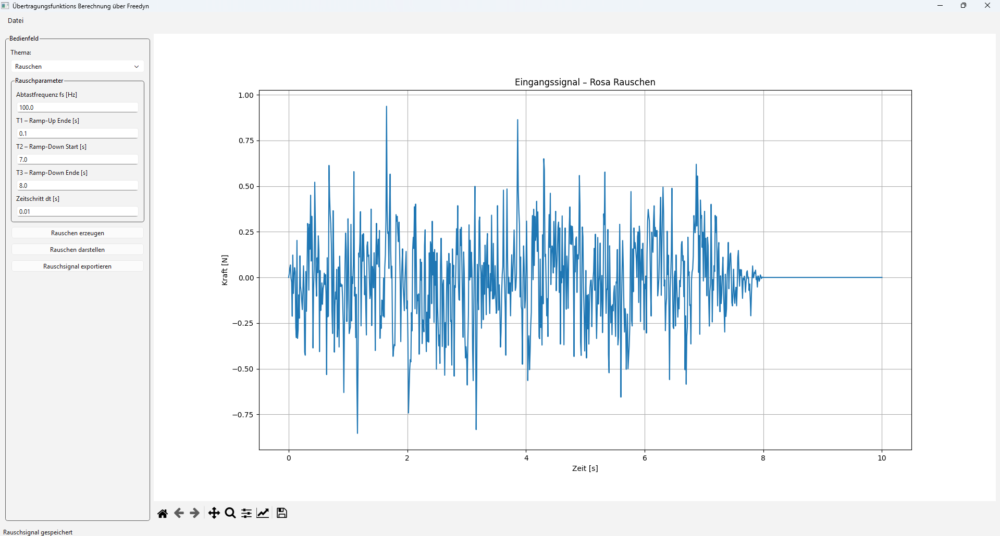
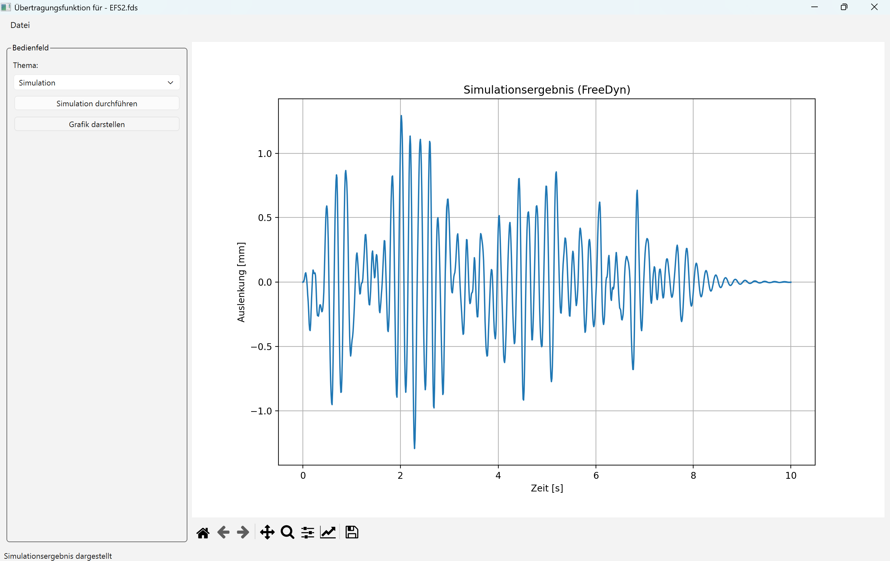
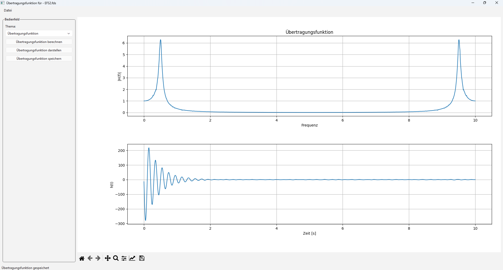

# Übertragungsfunktionsrechner über Freedyn
**Oliver Straßl**
Visualisierung und Datenverarbeitung – Abschlussprojekt

---

## Problem / Motivation

- Erzeugen eines Verrauschten Signals (Rosa Rauschen)
- Berechnung der Übertragungsfunktion
- Kein Reales Model, sondern Freedyn
- viele Anwendungen für Übertragungsfunktion (z.B. Prüfstands Technik, Inverse Kinematik, Regelungstechnik, ....)

---

## Ansatz
- Programm: Visual-Studio-Code
- Programmiersprache: Python
- Python-Bibliotheken siehe README
- Aufteilung in drei Blöcke
    - Rauschen erzeugen
    - Simulation
    - Übertragungsfunktion berechnen

---

## Screenshots der Anwendung
Rauschesignal erzeugen:

---

## Screenshots der Anwendung
Simulation:

---

## Screenshots der Anwendung
Übertragungsfunktion:

---

## Demo
Live-Demonstration

---

## Ergebnisse
- Rauschsignal wird erzeugt und richtig exportiert
- Freedyn Simulation wird durchgeführt.
- Übertragungsfunktion wird erzeugt und exportiert

---

## Herausforderungen und Lösungen
- Interaktion mit Freedyn -> Modul API oder command(...)
- Richtige Fehlerausgabe über das Fenster -> Sicherheitsprüfung
- Überblick behalten -> Struktur
- Richtige Befehle -> Foren & ChatGPT

---

## Gewonnene Erkenntnisse
- Wichtig beim Programmieren
    - richtige Projekt Planung/Struktur
    - in Funktionen gliedern
- Fehlersuche kann durch ChatGPT beschleunigt werden

---

## Vielen Dank für die Aufmerksamkeit
Fragen?

